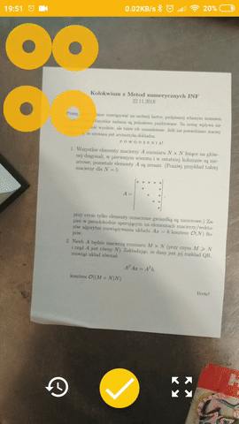

# ScanShine
ScanShine - quickly take shining scans of your documents by using only your android phone. This scanner app takes pictures of docs, trims, enhances, and let you share them to your friends. Everything packed in an optimistic sunshine theme. It uses the power of opencv in C++ android ndk to process frames in real time in order to find papersheet on preview.

## Demos:

